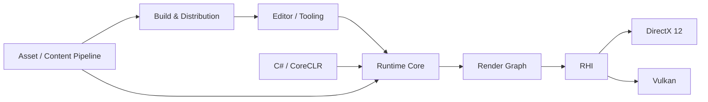

# Park Young Ung

### Engine Programmer

Building game engine architecture, runtime systems, rendering infrastructure, and development tools in C++.

---

## Engine Focus

<table>
<tr>
<td width="50%" valign="top">

### Runtime Architecture
Scene and component lifecycle, native/managed boundaries, reflection, serialization, and engine-level APIs.

</td>
<td width="50%" valign="top">

### Rendering
RHI abstraction, DirectX 12 / Vulkan backends, Render Graph architecture, shader systems, and GPU diagnostics.

</td>
</tr>
<tr>
<td width="50%" valign="top">

### Tooling
Dear ImGui editor, inspectors, content workflows, debugging tools, and reflection-driven authoring.

</td>
<td width="50%" valign="top">

### Parallel Systems
Job systems, multithreaded runtime design, CPU/GPU parallelism, scheduling, and performance-oriented architecture.

</td>
</tr>
<tr>
<td width="50%" valign="top">

### Scripting
CoreCLR hosting, C# game scripting, Roslyn-based tooling, source generation, and native interop.

</td>
<td width="50%" valign="top">

### Content & Distribution
Asset import, cooking, packaging, build tooling, engine distributions, and project workflows.

</td>
</tr>
</table>

---

## CreatorEngine

**C++23 game engine for Windows, built as a long-term engine architecture project.**

### Architecture at a Glance

### Current System Areas

| Rendering | Runtime | Toolchain |
|---|---|---|
| DirectX 12 / Vulkan RHI | Scene / Component lifecycle | Dear ImGui editor |
| Render Graph | Reflection / Serialization | Asset import & cooking |
| Slang / shader pipeline | CoreCLR C# scripting | Roslyn tooling |
| GPU diagnostics | Physics / Audio integration | Packaging & distribution |

---

## Technology

 

| Area | Stack |
|---|---|
| **Languages** | C++23, C#, HLSL / Slang |
| **Graphics** | DirectX 12, Vulkan |
| **Runtime** | Win32, CoreCLR / .NET |
| **Editor** | Dear ImGui |
| **Physics / Audio** | PhysX, FMOD |
| **Content** | fastgltf, meshoptimizer |
| **Tooling** | Roslyn, Visual Studio, Git |

---

## Engineering Interests

`Engine Architecture` `Data-Oriented Design` `Render Graph` `RHI` `Multithreading`  
`Reflection` `Scripting Runtime` `Asset Pipeline` `Build Systems` `Diagnostics`

Most of my public work is centered around building and refining CreatorEngine.

