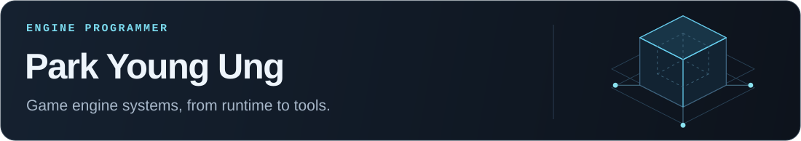
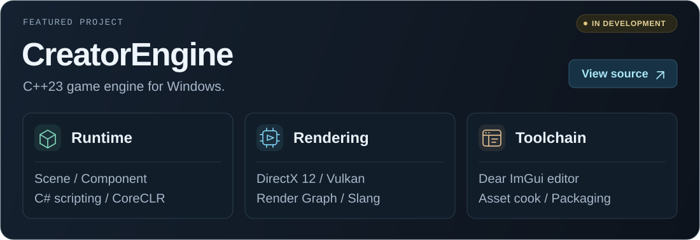
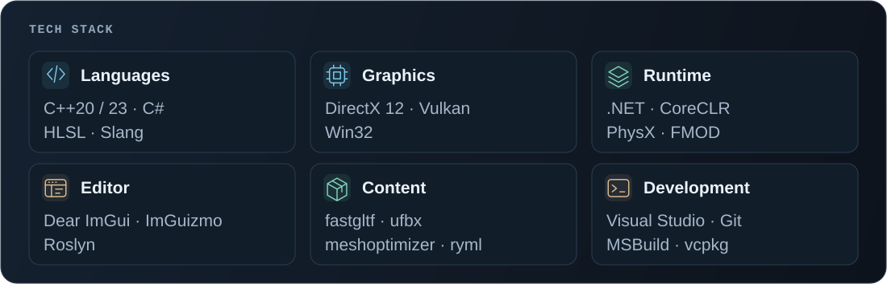
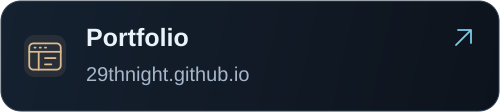
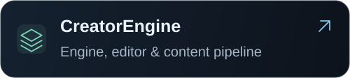
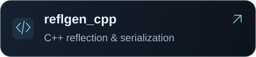
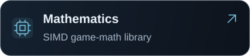

  <picture>
    <source media="(max-width: 600px)" srcset="./assets/profile-header-mobile.svg">
    
  </picture>

  <a href="https://github.com/29thnight/CreatorEngine">
    <picture>
      <source media="(max-width: 600px)" srcset="./assets/creator-engine-mobile.svg">
      
    </picture>
  </a>

  <a href="https://github.com/29thnight/CreatorEngine">Source code</a>
  &nbsp; · &nbsp;
  <a href="https://github.com/29thnight/CreatorEngine/blob/master/docs/README.md">Documentation</a>

  <picture>
    <source media="(max-width: 600px)" srcset="./assets/tech-stack-mobile.svg">
    
  </picture>

<h2>Interests</h2>

<ul>
  <li><strong>Performance</strong> — Data-oriented design, memory allocation, and job scheduling.</li>
  <li><strong>Metaprogramming</strong> — Compile-time reflection, serialization, and source generation.</li>
  <li><strong>Engine architecture</strong> — Render graphs, native/managed boundaries, and build pipelines.</li>
</ul>

<h2>Portfolio</h2>

  
  

  
  

